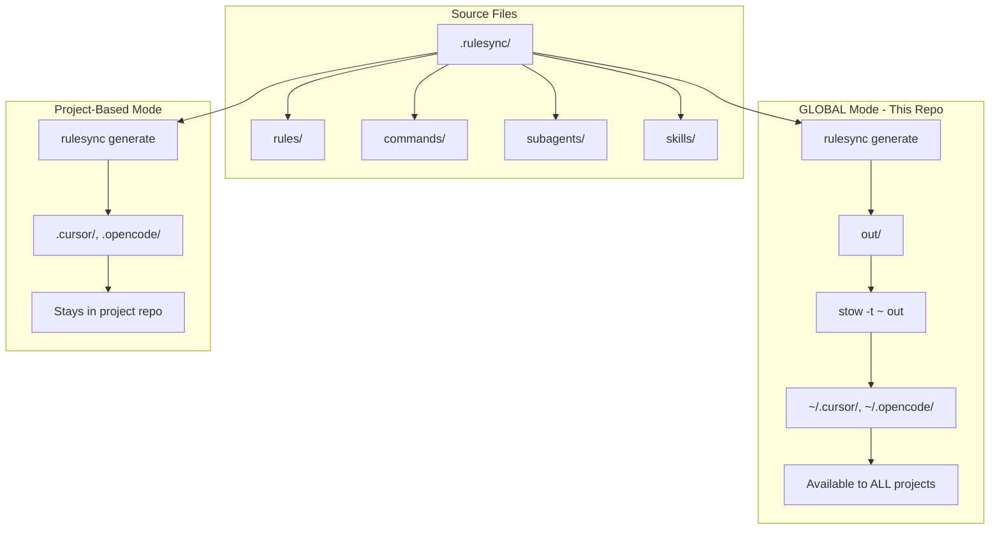

# AI Tooling

A centralized repository for managing AI coding assistant configurations across multiple tools (Cursor, GitHub Copilot, Claude Code, Codex CLI, and OpenCode) using [rulesync](https://github.com/dyoshikawa/rulesync) and GNU Stow for symlink management.

## Overview

This repository provides a unified way to manage:
- **Rules**: Coding guidelines and project-specific instructions
- **Commands**: Custom commands for AI assistants (e.g., commit, PR creation)
- **Subagents**: Specialized AI agents for specific tasks (e.g., planner)
- **Skills**: Reusable instructions for specific tasks
- **MCP Servers**: Model Context Protocol server configurations
- **Ignore Patterns**: Files and patterns to exclude from AI context

All configurations are written once in the `.rulesync/` directory and automatically generated for each target AI tool, then symlinked into your home directory using GNU Stow.

## How It Works

This repository uses rulesync in **GLOBAL mode** with GNU Stow to make AI configurations available to all projects on your machine. There are two ways to use rulesync:



### GLOBAL Mode (This Repository)

- **Source**: `.rulesync/` directory in this centralized AI-Tools repo
- **Generate**: `rulesync generate` outputs tool-specific configs to `out/`
- **Symlink**: `stow -t ~ out` creates symlinks in your home directory (`~/.cursor/`, `~/.opencode/`, etc.)
- **Result**: Configurations are available to **all projects** on your machine

### Project-Based Mode

- **Source**: `.rulesync/` directory lives in your project repo
- **Generate**: `rulesync generate` with `baseDirs: ["."]` outputs directly to the project
- **Result**: Configurations stay in the project and are committed to the repo

## Prerequisites

- **Node.js** and **npm** (for running `rulesync`)
- **GNU Stow** (for symlink management)
  - Install via Homebrew: `brew install stow`

## Installing Rulesync

### Via npm (recommended)

```bash
npm install -g rulesync
```

### Via Homebrew

```bash
brew install rulesync
```

### Without Installation (npx)

You can run rulesync without installing it globally:

```bash
npx rulesync --version
npx rulesync --help
```

## Installation

1. Clone this repository:
   ```bash
   git clone <repository-url>
   cd AI-Tools
   ```

2. Make the sync script executable:
   ```bash
   chmod +x sync.sh
   ```

3. Run the sync script to generate configurations and create symlinks:
   ```bash
   ./sync.sh
   ```

This will:
- Generate target-specific configuration files in the `out/` directory
- Create symlinks in your home directory (`~`) using GNU Stow

## Usage

### Syncing Configurations

After making changes to any files in `.rulesync/`, run:

```bash
./sync.sh
```

This script:
1. Runs `rulesync generate` to create configuration files for all targets specified in `rulesync.jsonc`
2. Uses `stow` to symlink the generated files to your home directory

### Manual Sync

You can also run the commands manually:

```bash
# Generate configurations
npx rulesync generate \
  --targets cursor,opencode \
  --features commands,rules,subagents,skills \
  --delete

# Create symlinks
stow -t ~ out
```

## Repository Structure

```
AI-Tools/
├── .rulesync/              # Source configuration files
│   ├── rules/              # Coding rules and guidelines
│   │   └── overview.md     # General project guidelines
│   ├── commands/           # Custom AI assistant commands
│   │   ├── commit.md       # Conventional commits command
│   │   └── create-pr.md    # PR creation command
│   ├── subagents/          # Specialized AI agents
│   │   └── planner.md      # Planning agent
│   ├── skills/             # Reusable AI skills
│   │   └── example-skill/  # Example skill (delete and replace)
│   │       └── SKILL.md
│   ├── mcp.json            # MCP server configurations
│   └── .aiignore           # Files to ignore in AI context
├── out/                    # Generated output (gitignored)
│   ├── .cursor/            # Cursor-specific configs
│   ├── .opencode/          # OpenCode-specific configs
│   └── AGENTS.md           # Shared agent guidelines
├── rulesync.jsonc          # Rulesync configuration
├── sync.sh                 # Sync script
└── README.md               # This file
```

## Configuration

### rulesync.jsonc

The main configuration file defines:

- **targets**: AI tools to generate configs for (`copilot`, `cursor`, `claudecode`, `codexcli`, `opencode`)
- **features**: What to generate (`rules`, `ignore`, `mcp`, `commands`, `subagents`, `skills`)
- **baseDirs**: Output directory (default: `./out`)
- **delete**: Whether to delete old files during generation

### Adding New Rules

1. Create a new markdown file in `.rulesync/rules/`
2. Add frontmatter with target specifications:
   ```markdown
   ---
   root: true
   targets: ["*"]  # or specific targets like ["cursor", "copilot"]
   description: "Your rule description"
   globs: ["**/*"]  # Files this rule applies to
   ---
   
   # Your Rule Title
   
   Your rule content here...
   ```
3. Run `./sync.sh` to apply changes

### Adding New Commands

1. Create a new markdown file in `.rulesync/commands/`
2. Add frontmatter:
   ```markdown
   ---
   targets: ["*"]
   description: "Command description"
   ---
   
   Your command instructions...
   ```
3. Run `./sync.sh` to apply changes

### Adding New Subagents

1. Create a new markdown file in `.rulesync/subagents/`
2. Add frontmatter with agent configuration:
   ```markdown
   ---
   name: agent-name
   targets: ["*"]
   description: "Agent description"
   ---
   
   Agent instructions...
   ```
3. Run `./sync.sh` to apply changes

### Adding New Skills

Skills are directory-based and can include supporting files alongside the main `SKILL.md`.

1. Create a new directory in `.rulesync/skills/` with your skill name
2. Create a `SKILL.md` file with frontmatter:
   ```markdown
   ---
   name: your-skill-name
   description: "What this skill does"
   targets: ["*"]
   ---
   
   Skill instructions and content...
   ```
3. Optionally add supporting files (templates, examples) in the same directory
4. Run `./sync.sh` to apply changes

## Supported AI Tools

- **Cursor**: AI-powered code editor
- **GitHub Copilot**: AI pair programmer
- **Claude Code**: Anthropic's coding assistant
- **Codex CLI**: OpenAI's command-line coding assistant
- **OpenCode**: Open-source coding assistant

## MCP Servers

The repository includes MCP (Model Context Protocol) server configurations in `.rulesync/mcp.json`:

- **serena**: IDE assistant with web dashboard support
- **context7**: Upstash Context7 MCP server

## Troubleshooting

### Symlinks Not Working

If symlinks aren't created properly:
- Ensure GNU Stow is installed: `which stow`
- Check for existing conflicting files in your home directory
- Use `stow -n -t ~ out` to simulate what stow would do (dry run)

### Rules Not Appearing

- Verify the target in the rule's frontmatter matches your AI tool
- Check that the feature is enabled in `rulesync.jsonc`
- Ensure the file is in the correct directory (`.rulesync/rules/`)

### Stow Conflicts

If Stow reports conflicts:
- Remove or rename conflicting files in your home directory
- Use `stow --adopt -t ~ out` to adopt existing files (use with caution)

## Contributing

When adding new configurations:

1. Edit files in `.rulesync/` (never edit files in `out/` directly)
2. Test your changes by running `./sync.sh`
3. Verify the generated output in `out/`
4. Commit your changes
