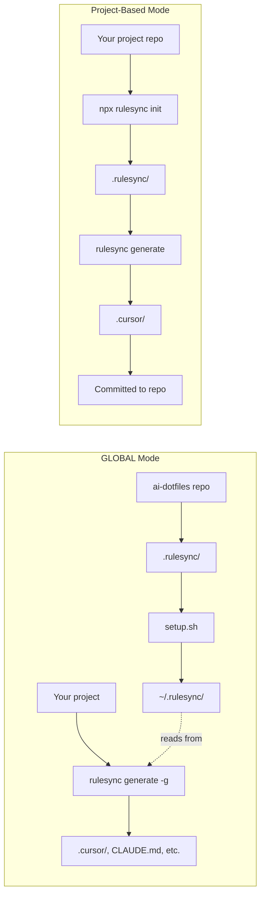

# AI Dotfiles

Manage your AI coding assistant settings in one place, then automatically sync them to all your projects.

## The Problem

AI coding assistants like Cursor, Claude Code, and GitHub Copilot each have their own configuration files. If you want consistent behavior across tools and projects, you end up:

- Copying the same rules to every project
- Maintaining duplicate configs that get out of sync
- Recreating your setup on new machines

## The Solution

This repository lets you:

1. **Write your AI configurations once** in a simple format
2. **Auto-generate** tool-specific configs for Cursor, Claude Code, OpenCode, etc.
3. **Sync everywhere** so all your projects use the same settings

## Quick Start

### 1. Install rulesync

```bash
npm install -g rulesync
```

### 2. Clone and set up

```bash
git clone <repository-url>
cd ai-dotfiles
chmod +x setup.sh
./setup.sh
```

This creates a symlink from `~/.rulesync` to your repo's `.rulesync/` directory.

### 3. Generate configs in your projects

```bash
cd /path/to/your/project
rulesync generate -g
```

That's it! Your AI configurations are now generated in each project you work on.

## How It Works



**GLOBAL Mode** (what this repo does):
- Your configs live in this central repo
- `setup.sh` creates a symlink from `~/.rulesync` to your repo
- Run `rulesync generate -g` in any project to generate configs from the global source
- Every project on your machine can use the same settings

**Project-Based Mode** (alternative):
- Configs live inside a specific project
- Generated files are committed to that repo
- Only that project uses them

## What You Can Configure

All your settings live in the `.rulesync/` folder:

| Folder | What it does | Example |
|--------|--------------|---------|
| `rules/` | Coding guidelines the AI follows | "Use TypeScript", "Prefer composition over inheritance" |
| `commands/` | Custom slash commands | `/commit` for conventional commits, `/create-pr` for pull requests |
| `subagents/` | Specialized AI agents | A "planner" agent for designing features |
| `skills/` | Reusable instructions | Templates for common tasks |
| `mcp.json` | External tool connections | Connect to documentation servers |
| `.aiignore` | Files to hide from AI | Ignore `node_modules/`, `.env` files |

## Making Changes

After editing any files in `.rulesync/`, regenerate configs in your projects:

```bash
cd /path/to/your/project
rulesync generate -g
```

This regenerates all AI tool configs from your global `.rulesync/` source.

## Customizing Your Setup

The `rulesync.jsonc` file controls which AI tools and features are synced. Open it to customize:

### Adding or Removing AI Tools

The `targets` array controls which AI tools receive your configurations:

```json
{
  "targets": [
    "cursor",      // Cursor editor
    "claudecode",  // Claude Code
    "opencode"     // OpenCode
  ]
}
```

**Want to add GitHub Copilot?** Add `"copilot"` to the array:

```json
{
  "targets": [
    "cursor",
    "claudecode",
    "opencode",
    "copilot"
  ]
}
```

**Only using Cursor?** Remove the others:

```json
{
  "targets": [
    "cursor"
  ]
}
```

Available targets: `cursor`, `claudecode`, `opencode`, `copilot`, `codexcli`, `geminicli`, `cline`, `kilocode`, `roocode`

### Enabling or Disabling Features

The `features` array controls what types of configurations are generated:

```json
{
  "features": [
    "rules",      // Coding guidelines
    "commands",   // Custom slash commands
    "subagents",  // Specialized AI agents
    "skills",     // Reusable instructions
    "ignore",     // .aiignore patterns
    "mcp"         // External tool connections
  ]
}
```

**Don't use subagents?** Remove it:

```json
{
  "features": [
    "rules",
    "commands",
    "skills"
  ]
}
```

**Only want rules?** Keep just that:

```json
{
  "features": [
    "rules"
  ]
}
```

After changing `rulesync.jsonc`, run `rulesync generate -g` in your projects to apply your changes.

## Adding Your Own Configurations

Each configuration file has a `targets` field in its frontmatter that controls which AI tools receive it:

- `targets: ["*"]` — Send to **all tools** in your `rulesync.jsonc` config
- `targets: ["cursor", "claudecode"]` — Send **only to these specific tools**

This lets you have universal configs and tool-specific ones. For example, if a feature only works in Cursor, set `targets: ["cursor"]` so it doesn't get sent to other tools.

### Rules

Rules are coding guidelines the AI will follow. Create a markdown file in `.rulesync/rules/`:

```markdown
---
root: true
targets: ["*"]
description: "My coding standards"
globs: ["**/*"]
---

# My Coding Standards

- Use TypeScript for all new code
- Write tests for new features
- Use meaningful variable names
```

### Commands

Commands are custom actions you can trigger with `/command-name`. Create a markdown file in `.rulesync/commands/`:

```markdown
---
targets: ["*"]
description: "Create a new React component"
---

Create a new React component with:
- TypeScript
- CSS modules
- Unit tests
```

### Subagents

Subagents are specialized AI assistants for specific tasks. Create a markdown file in `.rulesync/subagents/`:

```markdown
---
name: reviewer
targets: ["*"]
description: "Code review specialist"
---

You are a code reviewer. Focus on:
- Security issues
- Performance problems
- Code clarity
```

### Skills

Skills are reusable instruction sets. Create a folder in `.rulesync/skills/your-skill-name/` with a `SKILL.md` file:

```markdown
---
name: api-design
description: "REST API design patterns"
targets: ["*"]
---

When designing REST APIs:
- Use plural nouns for resources
- Return appropriate HTTP status codes
- Include pagination for lists
```

## Using Project-Based Mode

If you want AI configs for just one specific project (instead of using global configs), you can set up rulesync directly in that repo:

```bash
# Go to your project
cd /path/to/your/project

# Initialize rulesync
npx rulesync init

# Generate configs (without -g flag for local mode)
npx rulesync generate

# Optionally add generated files to .gitignore
npx rulesync gitignore
```

The generated files (`.cursor/`, `CLAUDE.md`, etc.) will be created in your project and can be committed to version control.

## Supported AI Tools

| Tool | Description |
|------|-------------|
| [Cursor](https://cursor.sh) | AI-powered code editor |
| [Claude Code](https://claude.ai/code) | Anthropic's coding assistant |
| [GitHub Copilot](https://github.com/features/copilot) | AI pair programmer |
| [OpenCode](https://github.com/opencode-ai/opencode) | Open-source coding assistant |
| [Codex CLI](https://github.com/openai/codex) | OpenAI's command-line assistant |

## Repository Structure

```
ai-dotfiles/
├── .rulesync/              # Your source configs (edit these!)
│   ├── rules/              # Coding guidelines
│   ├── commands/           # Custom commands
│   ├── subagents/          # Specialized agents
│   ├── skills/             # Reusable skills
│   ├── mcp.json            # External tool connections
│   └── .aiignore           # Files to hide from AI
├── rulesync.jsonc          # Rulesync settings
├── setup.sh                # Run once to create ~/.rulesync symlink
└── README.md
```

## Troubleshooting

### Symlink already exists

If `setup.sh` reports that `~/.rulesync` already exists:
```bash
# Check what it points to
ls -la ~/.rulesync

# Remove it if it's outdated
rm ~/.rulesync

# Run setup again
./setup.sh
```

### Changes not appearing

1. Make sure you edited files in `.rulesync/`
2. Run `rulesync generate -g` in your project to regenerate
3. Restart your AI tool to pick up changes

## Learn More

- [Rulesync Documentation](https://github.com/dyoshikawa/rulesync)
