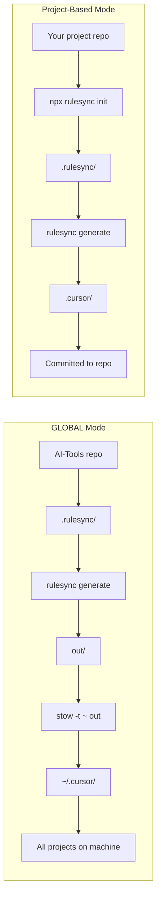

# AI Tooling

Manage your AI coding assistant settings in one place, then automatically sync them to all your projects.

## The Problem

AI coding assistants like Cursor, Claude Code, and GitHub Copilot each have their own configuration files. If you want consistent behavior across tools and projects, you end up:

- Copying the same rules to every project
- Maintaining duplicate configs that get out of sync
- Recreating your setup on new machines

## The Solution

This repository lets you:

1. **Write your AI configurations once** in a simple format
2. **Auto-generate** tool-specific configs for Cursor, Claude Code, OpenCode, etc.
3. **Sync everywhere** so all your projects use the same settings

## Quick Start

### 1. Install the tools

```bash
# Install rulesync (converts your configs to each tool's format)
npm install -g rulesync

# Install stow (creates shortcuts to your configs)
brew install stow
```

### 2. Clone and set up

```bash
git clone <repository-url>
cd AI-Tools
chmod +x sync.sh
```

### 3. Run the sync

```bash
./sync.sh
```

That's it! Your AI configurations are now available to all projects on your machine.

## How It Works



**GLOBAL Mode** (what this repo does):
- Your configs live in this central repo
- `rulesync` converts them to each AI tool's format
- `stow` creates shortcuts in your home folder
- Every project on your machine can use them

**Project-Based Mode** (alternative):
- Configs live inside a specific project
- Generated files are committed to that repo
- Only that project uses them

## What You Can Configure

All your settings live in the `.rulesync/` folder:

| Folder | What it does | Example |
|--------|--------------|---------|
| `rules/` | Coding guidelines the AI follows | "Use TypeScript", "Prefer composition over inheritance" |
| `commands/` | Custom slash commands | `/commit` for conventional commits, `/create-pr` for pull requests |
| `subagents/` | Specialized AI agents | A "planner" agent for designing features |
| `skills/` | Reusable instructions | Templates for common tasks |
| `mcp.json` | External tool connections | Connect to documentation servers |
| `.aiignore` | Files to hide from AI | Ignore `node_modules/`, `.env` files |

## Making Changes

After editing any files in `.rulesync/`, run:

```bash
./sync.sh
```

This regenerates all configs and updates the shortcuts.

## Adding Your Own Configurations

### Rules

Rules are coding guidelines the AI will follow. Create a markdown file in `.rulesync/rules/`:

```markdown
---
root: true
targets: ["*"]
description: "My coding standards"
globs: ["**/*"]
---

# My Coding Standards

- Use TypeScript for all new code
- Write tests for new features
- Use meaningful variable names
```

### Commands

Commands are custom actions you can trigger with `/command-name`. Create a markdown file in `.rulesync/commands/`:

```markdown
---
targets: ["*"]
description: "Create a new React component"
---

Create a new React component with:
- TypeScript
- CSS modules
- Unit tests
```

### Subagents

Subagents are specialized AI assistants for specific tasks. Create a markdown file in `.rulesync/subagents/`:

```markdown
---
name: reviewer
targets: ["*"]
description: "Code review specialist"
---

You are a code reviewer. Focus on:
- Security issues
- Performance problems
- Code clarity
```

### Skills

Skills are reusable instruction sets. Create a folder in `.rulesync/skills/your-skill-name/` with a `SKILL.md` file:

```markdown
---
name: api-design
description: "REST API design patterns"
targets: ["*"]
---

When designing REST APIs:
- Use plural nouns for resources
- Return appropriate HTTP status codes
- Include pagination for lists
```

## Using Project-Based Mode

If you want AI configs for just one specific project (instead of all projects), you can set up rulesync directly in that repo:

```bash
# Go to your project
cd /path/to/your/project

# Initialize rulesync
npx rulesync init

# Edit rulesync.jsonc and set baseDirs to current directory
# "baseDirs": ["."]

# Generate configs
npx rulesync generate

# Optionally add generated files to .gitignore
npx rulesync gitignore
```

The generated files (`.cursor/`, `CLAUDE.md`, etc.) will be created in your project and can be committed to version control.

## Supported AI Tools

| Tool | Description |
|------|-------------|
| [Cursor](https://cursor.sh) | AI-powered code editor |
| [Claude Code](https://claude.ai/code) | Anthropic's coding assistant |
| [GitHub Copilot](https://github.com/features/copilot) | AI pair programmer |
| [OpenCode](https://github.com/opencode-ai/opencode) | Open-source coding assistant |
| [Codex CLI](https://github.com/openai/codex) | OpenAI's command-line assistant |

## Repository Structure

```
AI-Tools/
├── .rulesync/              # Your source configs (edit these!)
│   ├── rules/              # Coding guidelines
│   ├── commands/           # Custom commands
│   ├── subagents/          # Specialized agents
│   ├── skills/             # Reusable skills
│   ├── mcp.json            # External tool connections
│   └── .aiignore           # Files to hide from AI
├── out/                    # Generated output (don't edit!)
├── rulesync.jsonc          # Rulesync settings
├── sync.sh                 # Run this after changes
└── README.md
```

## Troubleshooting

### "stow: command not found"

Install GNU Stow:
```bash
brew install stow
```

### Symlinks not working

Check for conflicting files in your home directory:
```bash
# See what stow would do (dry run)
stow -n -t ~ out
```

If there are conflicts, remove or rename the existing files, then run `./sync.sh` again.

### Changes not appearing

1. Make sure you edited files in `.rulesync/` (not `out/`)
2. Run `./sync.sh` to regenerate
3. Restart your AI tool to pick up changes

## Learn More

- [Rulesync Documentation](https://github.com/dyoshikawa/rulesync)
- [GNU Stow Manual](https://www.gnu.org/software/stow/manual/)
